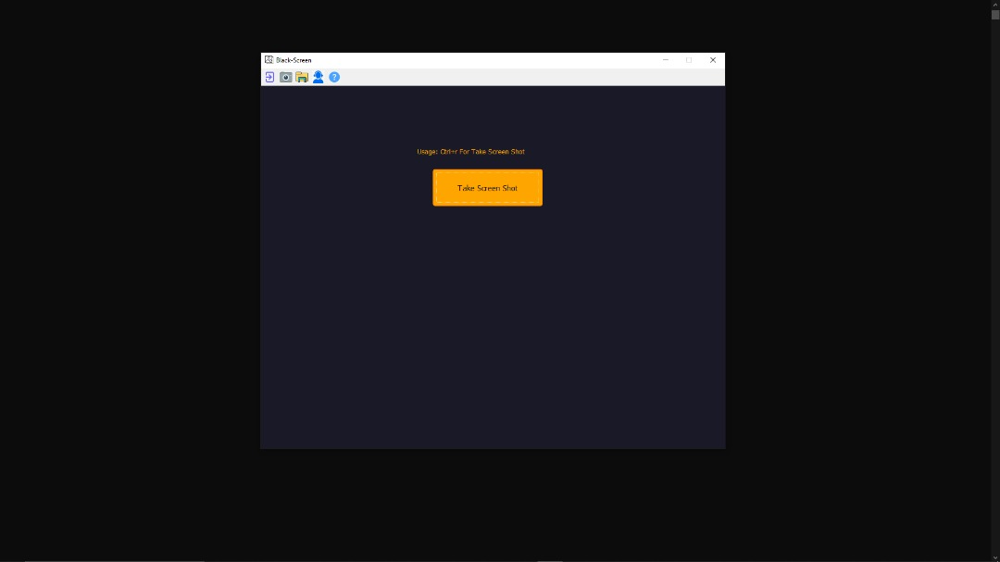
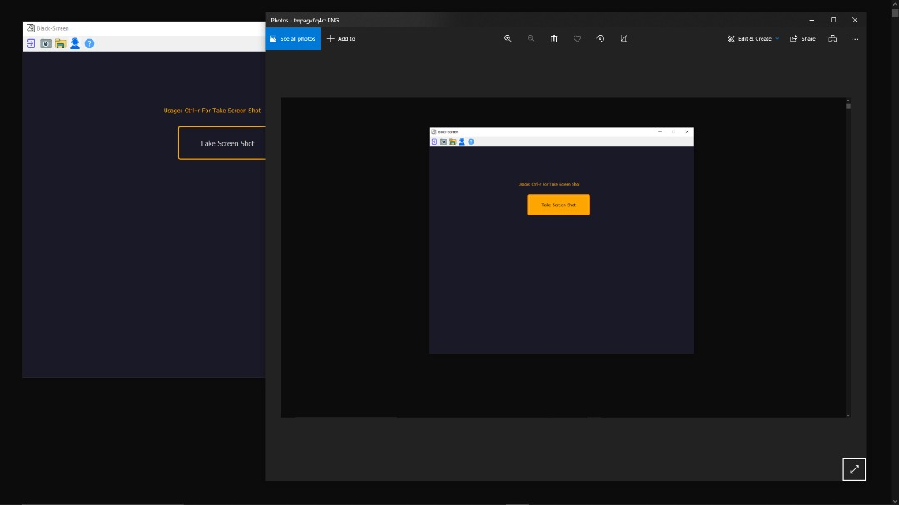

# Black-Screen ⬛

[](https://www.python.org/downloads/)
[](https://github.com/black-software-Com/Black-Screen)
<br>

<center>
<a href="https://github.com/black-software-com/black-screen" title="Black-Screen Logo" target="_top">

</a>
</center>
<hr>

## Scr




---
## Installing

**Installing On Linux,MacOS**
``` sh
git clone https://github.com/black-software-com/black-screen

cd black-screen

bash install.sh

python black.py
```

**Installing On Windows**
``` txt
First Installing Python

And Installing Black-Screen Zip File

Extract File

Open Cmd And Go To Black-Screen Directory

and Usage:
          python black.py
```
---
<br>
<center>

<a href="https://github.com/black-software-Com/Black-Screen-Help/archive/refs/heads/master.zip" title="Download Black-Screen">

</a>
<br><br>
<a href="https://www.python.org/ftp/python/3.10.1/python-3.10.1-amd64.exe" title="Download Python" target="_top">

</a>
</center>

---
#### [License 📝](https://github.com/black-software-Com/Black-Screen/blob/master/LICENSE)
#### [Help ❔](https://black-software-com.github.io/Black-Screen-Help/)
---
